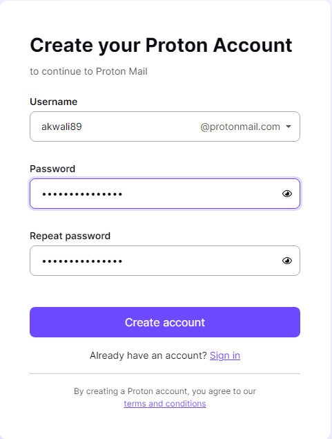

# A02: Creación de un perfil Sock Puppet

**Alumno:** Juan Manuel Cumbrera López

**Curso:** CIBER

**Fecha:** 04/11/2023

 

## Índice

- [Introducción](#introducción)
- [Usos habituales de los Sock Puppets](#usos-habituales-de-los-sock-puppets)
- [Preparación de una máquina virtual](#preparación-de-una-máquina-virtual)
- [Creación del Sock Puppet](#creación-del-sock-puppet)
- [Actividad en la plataforma o redes sociales](#actividad-en-la-plataforma-o-redes-sociales)
- [Cosas a tener en cuenta](#cosas-a-tener-en-cuenta)
- [Conclusiones](#conclusiones)
- [Bibliografía](#bibliografía)

[...]

 

## Introducción

Los perfiles ***Sock Puppet*** (o *Títeres de Calcetín* del inglés, lo que hace referencia a un tipo de marioneta pequeña hecha con un calcetín) son un término ampliamente utilizado en el ámbito del hacking ético y el ciberespionaje, lo que alude a perfiles o identidades ficticias creadas por un investigador durante sus labores OSINT con el objetivo de ocultar su verdadera identidad en línea. 

Cuando se investiga a un objetivo, obviamente usar nuestra identidad real no es una opción viable, lo que lleva al investigador a utilizar cuentas falsas en redes sociales, servicios de mensajería electrónica, teléfonos falsos, etc, con el fin de poder investigar sin el temor a ser descubiertos, además de asegurarse de no dejar un rastro de nuestra actividad que pudiera llevar a otros a descubrirnos.

 

## Usos habituales de los Sock Puppets

Las cuentas *Sock Puppet* se utilizan principalmente por investigadores con el propósito de llevar a cabo sus estudios de manera anónima, permitiéndoles explorar temas sensibles o participar en comunidades en línea sin revelar su identidad. Algunas de las aplicaciones más comunes de estas cuentas incluyen:

- Suplatación de identidad

- Investigaciones OSINT

- Investigaciones HUMINT

- Manipulación en redes sociales

- Disputas políticas

Además debemos tener en cuenta que podemos llevar a cabo dos tipos de investigaciones, teniendo en cuenta nuestra interacción con el objetivo a seguir. Esto nos abre dos posibilidades, siendo:

- **Investigación pasiva** La investigación pasiva implica no interactuar con un objetivo. Sin embargo, tu perfil podría aparecer en los resultados de cosas como "amigos sugeridos" o "personas a seguir", por lo que es posible que desees pasar desapercibido.

- **Investigación activa** La investigación activa implica interactuar de alguna manera con el objetivo, por ejemplo, agregando al objetivo como amigo en Facebook. En la investigación activa, es aún más importante pasar desapercibido en el grupo objetivo. Si estás interactuando con un objetivo, es posible que desees crear algunas cuentas en diferentes plataformas para que parezca que eres una persona real.

 

## Preparación de una máquina virtual

Para llevar a cabo la creación de un Sock Puppet necesitaremos un entorno en el que trabajar, y para ello hemos elegido una máquina virtual con el sistema operativo Windows 10, de modo que la instalamos haciendo uso de VirtualBox.

Una vez que tenemos la máquina virtual con el SO Windows 10 instalado y funcionando, nos ocuparemos de instalar una VPN, a fin de hacer nuestro rastro más complicado de seguir. Para esta tarea hemos elegido la VPN ***HotspotShield***, la cual tiene una versión gratuita que usaremos.

 

## Creación del Sock Puppet

Ahora que tenemos dispuesta nuestra plataforma de trabajo, comenzamos creando una identidad ficticia, y para ello nos servimos de la página web [Fake Name Generator](https://www.fakenamegenerator.com/). Hemos de recalcar que previamente a este paso, debemos tener ya en mente una idea para la nueva identidad, y en nuestro caso tuvimos en cuenta alejar la identidad ficticia de nuestra identidad real en todo sentido posible, lo cual implica crear una identidad de otra nacionalidad, otra lengua, otro género, a fin de hacerla lo más diferente posible a nosotros.

Teniendo este dato en mente, elegimos un nombre femenino de Inglaterra/Gales y estadounidense de nacionalidad. Una vez establecidas estas opciones comenzamos a generar identidad hasta que nos topemos con una que encaje en la descripción que tenemos en mente.

Como podemos ver, hemos salvado esta identidad para poder usarla luego, aunque existe la posibilidad que cambiemos algunos valores de la misma por ajustarla a nuestras necesidades.
Otra cosa que necesitaremos será, al menos, una imagen de nuestra nueva identidad, y para ello acudiremos a la página web [This Person Does Not Exist](https://www.thispersondoesnotexist.com/), a fin de generar una imagen de una persona que coincida con las características de nuestra identidad ficticia.

Luego ampliamos un poco la imagen haciendo uso de la IA [DALL.E](https://labs.openai.com/).

Con todo esto ya tenemos que nuestra persona ficticia se llama Katherine Morgan, tiene 34 años, es estadounidense, por lo que obviamente su lengua natal es el inglés, y es arborista de profesión, o sea, se dedica al oficio del cultivo y cuidado de los árboles. Con esto último ya tenemos un rasgo de su personalidad, y es el gusto por la naturaleza, lo que además concuerda con ewl fondo verde y "natural" de su foto de perfil. Además, las facciones de su rostro concuerdan con los de una persona entre sus 30 y 35 años.

Ya tenemos una identidad ficticia, por lo que es hora de crear sus redes sociales, comenzando por su nueva cuenta de Twitter. Para elegir un nombre de la nueva cuenta hemos usado la página web [SpinXO](https://www.spinxo.com/email-names), lo que nos dió un resultado que nos agradó, el cual fué 89akwali, pero como las direcciones de correo electrónico han de empezar por una letra, simplemente lo cambiamos un poco, obteniendo ***akwali89***, a fin de poder usar este usuario en futuras cuentas de correo. Después, comenzamos con la creación de la cuenta de Twitter.

Por suerte para nosotros, la página [Fake Name Generator](https://www.fakenamegenerator.com/) nos provee de un correo falso capaz de recibir emials, lo que nos permite registrarnos en Twiiter.

Después de superar unos cuentos captchas, nuestra cuenta de Twitter está casi lista.

Tras unos cuantos retoques, la cuenta luce más creíble y convincente, además hemos seguido unos cuantos hilos y usuarios.

Hemos considerado necesario crearnos también un correo [ProtonMail](https://proton.me/es-es/mail), el cual hemos activado haciendo uso del correo proveído por la página Fake Name Generator.

Este correo seguro nos será muy útil, además de un email como Gmail o Hotmail.

 

## Actividad en la plataforma o redes sociales

Para mejorar el aspecto de la cuenta, dándole una capa de interacción con el resto del mundo, hemos escrito algún post relacionado con los gustos de nuestra identidad ficticia.

 

## Cosas a tener en cuenta

- Primeramente, además de idear una identidad ficticia y una personalidad falsa asociada a la misma, con unos intereses, aficiones y hobbies, necesitaremos un número de teléfono. Para esto debemos comprar una tarjeta SIM que podamos usar para registrarnos y activar autenticación de dos factores (2FA) en todas las cuentas que crees. 

- También será necesario obtener una tarjeta de crédito desechable. Un ejemplo de una página dedicada a ello es [Privacy](https://privacy.com/).

- Recordemos que si nuestra identidad es descubierta a través de algún fallo, como por ejemplo, seguirnos a nosotros mismos en redes sociales, no usar una VPN, etc, el Sock Puppet será completamente inservible, por lo que tendremos que destruirlo, incluyendo las SIM usadas, las cuentas, etc. El teléfono usado deberá ser borrado también.

 

## Conclusiones

Principalmente hallamos un problema, siendo uno que destacaba por sobre los demás, y es la falta de un número de teléfono, dado que numerosas redes sociales y servicios de mensajería electrónica hacen necesario uno. Además, muchas páginas que ofrecen números gratuitos no suelen ser válidos, lo que dificulta la tarea, siendo la única opción adquirir una SIM real.

Una vez logrado esto, podremos crear una red de cuentas interconectadas, que al suficiente tiempo darán la sensación de pertenecer a una persona común, gracias a las interracciones. amigos en redes sociales, la muestra de una personalidad convincente así como de un historial creíble. 

Conseguir esta meta puede sonar complejo, y es ciertamente un trabajo que requiere tiempo, paciencia, esfuerzo, dedicación y un gran ojo a los detalles, ya que como sabemos, el mínimo error o inconsistencia puede llevar a que se destape nuestra tapadera, haciendo inútil el Sock Puppet y obligándonos a crear otro desde 0.

 

## Bibliografía

- https://odint.net/sock-puppets-osint/

- https://www.sans.org/blog/what-are-sock-puppets-in-osint/

- https://www.reddit.com/r/OSINT/comments/dp70jr/my_process_for_setting_up_anonymous_sockpuppet/

- https://chat.openai.com/ (Creación de mensajes convincentes)